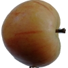
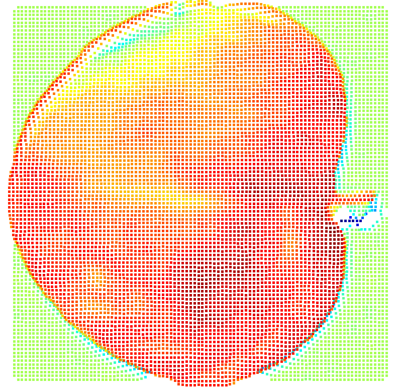

DAC-3D 苹果三维重建项目

项目实现
本项目基于多波长共聚焦成像（DAC-3D），实现苹果样品的三维高度图重建与点云可视化。  
包括图像预处理、暗场校正、图像配准、高度图计算、点云生成与滤波、可视化。

项目结构预览:
dac3d_reconstruction/
│
├─ data/
│ ├─ raw/ # 原始多波长图像（apple.jpg 或 TIFF）
│ └─ processed/ # 处理后的图像、高度图、点云等
│
├─ preprocessing/ # 图像预处理模块
│ ├─ image_loader.py # 读取默认样品图像
│ ├─ background_correction.py # 暗场校正
│ ├─ image_registration.py # 多通道图像配准
│ ├─ gaussian_filter.py # 高斯滤波去噪
│ └─ preprocessing_pipeline.py # 整体预处理流程
│
├─ reconstruction/ # 高度图和点云重建模块
│ ├─ simulate_lut.py # 生成模拟 LUT
│ ├─ height_calculator.py # 高度图计算
│ └─ cloud_filter.py # 点云滤波和保存
│
├─ visualization/ # 可视化脚本
│ └─ visualize.py # 高度图/点云可视化
│
└─ test/
└─ run.py # 完整运行示例

环境准备
1. 创建新的 Conda 环境（Python 3.10 或其他可选版本）：
conda create -n open3d python=3.10
conda activate open3d
2.安装依赖:
下载本目录后使用pip install -r requirements.txt下载本项目所需库(特别注意版本兼容问题)

项目运行
在项目目录dac3d_reconstruction/下执行python -m test.run
该命令会依次执行：
图像预处理（暗场校正 + 配准 + 高斯滤波）
模拟 LUT 生成
高度图计算
点云生成与滤波
高度图和点云可视化
运行完成后，你将得到处理结果：
高度图：data/processed/apple_height_map.tif
点云：data/processed/apple_pointcloud.ply
  
*图 1：苹果原图示例*
  
*图 2：苹果3d图示例*

特别说明:
如果你想要改变为其他物品的建模图,需要自行上传图片,在generate_data.py中将input_path = "apple.jpg",更改为你所上传的图片路径.
随后在LUT.py中更改为你上传图片的lut仿真表(需自己合理计算)

这是本人第一次上传的实验小项目，如有不足之处，欢迎提出建议和改进意见。

